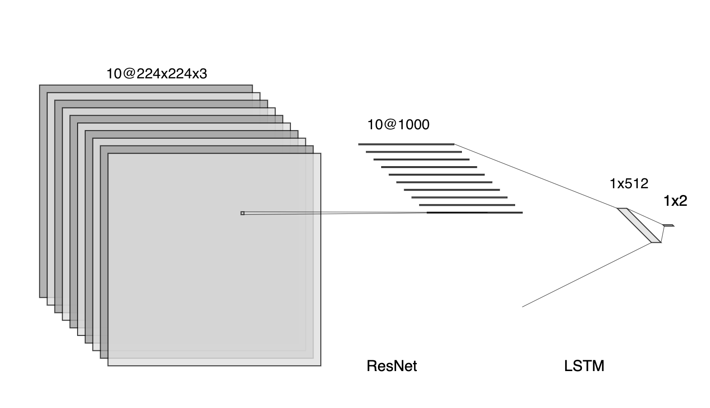
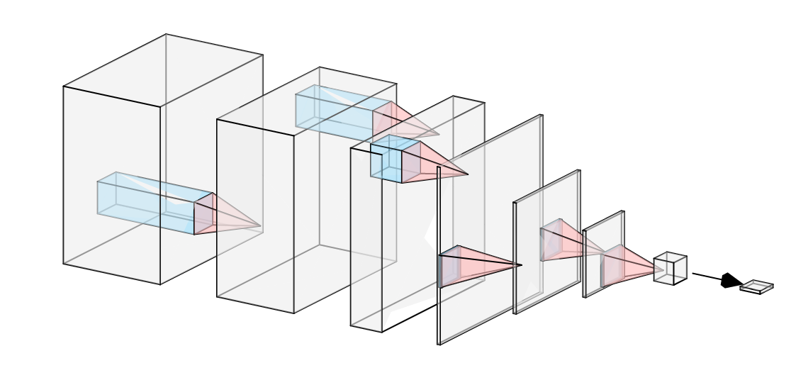
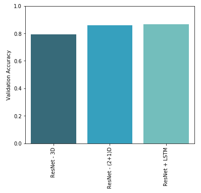
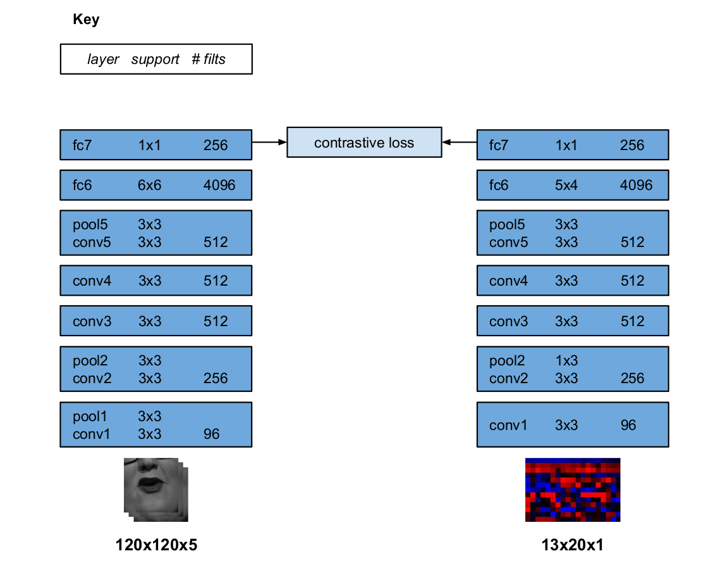
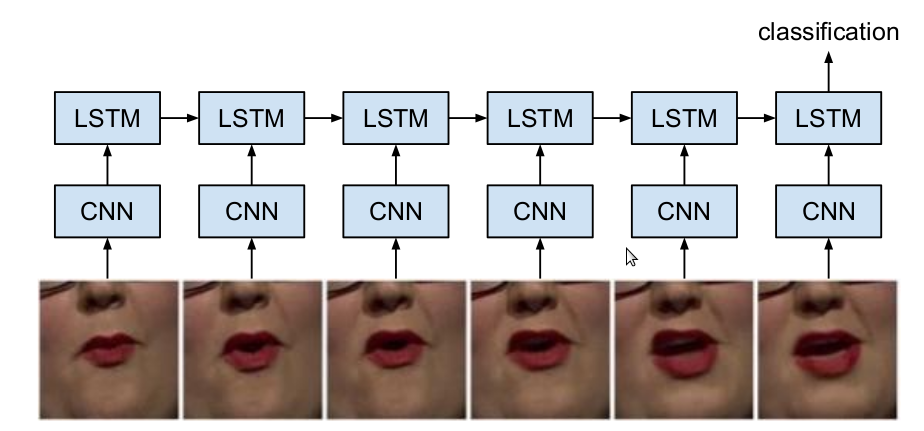

# Deepfake Detection

The goal of this work is to reliably distinguish deepfaked videos (and audio) from untampered videos (and audio). To improve coverage and accuracy, multiple approaches to deepfake detection are used (such as image classification of video frames and analyzing lip sync between audio and video). We found the most effective models were convolutional networks and LSTM's. The convolutional layers efficiently trained on visual imagery and LSTM's were indispensable for classification.

## Introduction

Over the past decade, attention toward "deepfakes" (artificially generated media) has grown rapidly. Deep-learning architectures specifically geared toward deepfake generation have been created and refined. Through the use of these architectures, state-of-the-art deepfakes are on their way to becoming indistinguishable to any unsuspecting viewer. Despite the leaps in deepfake generation, deep-learning architectures for deepfake detection are still in their infancy. In order to begin bridging this gap between deepfake generation and detection, Kaggle has hosted a competition for deepfake detection. In this paper we discuss our approach to this competition. We provide a brief overview of effective data exploration and processing for deepfake detection. The majority of the paper is then dedicated towards the explanation of various model architectures and their respective performances (both temporal and predictive). We then conclude with a summary of our results and a description of potential future steps.

## Data

After some exploration, the dataset consists of 100,000 videos of dimensions 1080x1920 (some horizontal, some vertical) pixels by 300 frames. There's about a 4:1 fake to real video ratio, and most fake videos include a reference to the original video from which they were produced. While there is no explicit label for this, most videos were deepfaked on the video by doing a face swap, while some videos were only audio deepfaked. We realized quickly that it was virtually impossible to train a model on the full video. Our initial models worked on heavily downsized frames, but still failed to train, since most of the important detail is in the faces, which virtually disappear after heavy downsizing.

Using [BlazeFace](https://arxiv.org/abs/1907.05047), a lightweight face detector from Google Research, we extract the face bounding box and resize it to 224x224. In this way, we downsize the frame going to the model, decreasing the need for overall model complexity, while also retaining the important detail.

However, even after downsizing the spatial aspect, the temporal aspect of the data proved too time intensive. To combat this, we only look at a subset of the frames (eg. every 10th frame from frame 100-200). This downsizing is particularly important given Kaggle's stringent time requirements: each video must be classified in approximately 8.1 seconds. A combination of model simplicity and downsizing the data is necessary to meet this requirement while achieving high classification accuracy.

Finally, we leverage the annotation pairing modified fake videos to their original videos. In training, we shuffle the fake videos, but feed in each corresponding original video directly after each fake video. In this way, we allow the model to be able to look past unimportant information that both videos have in common (background, pose, etc.) and easily exploit the differences in feature space between real and deepfaked videos. In practice, this allowed for much faster learning.

## Loss Function

In evaluation, each model is scored on log loss:

```math
\texttt{LogLoss} = -\frac{1}{n}\sum_{i=1}^{n}[y_i\log{(\hat{y_i})} + (1-y_i)\log{(1-\hat{y_i})}]
```
 
where
- n is the number of videos being predicted
- $\hat{y_i}$ is the predicted probability of the video being fake
- $y_i$ is the 1 if the video is fake, 0 if real

Note that the naive solution (guessing .5 probability for each prediction) results in a LogLoss of 0.693.

However, we find that training the model based on this loss causes it to overfit to the training set, resulting in overconfident predictions.

To combat this, we train our model on a modified version of [Maximum Entropy Loss](https://papers.nips.cc/paper_files/paper/2018/hash/0c74b7f78409a4022a2c4c5a5ca3ee19-Abstract.html):

```math
\texttt{MEL} = (1-\alpha)LogLoss + \alpha (H(\frac{1}{2})-H(\hat{y_i}))
```

where
- $MEL$ (Maximum Entropy Loss) is a convex combination between LogLoss and an entropy maximizing term
- $\alpha$ is a hyperparameter for weight of the entropy maximizing term
- $H(\hat{y_i}) = \hat{y_i}log(\hat{y_i}) + (1-\hat{y_i})log(\hat{y_i})$ is prediction entropy (discrete case, 2 classes)
- $H(\frac12) = log(\frac12)$ is the maximum possible entropy (discrete case, 2 classes)

Maximum Entropy Loss pushes probability estimates to the middle, where entropy is maximized. If the model input has no predictive power, the network will learn to output equal probability estimates to minimize the overall entropy term. As the network learns useful representations, it will push the predictions in the direction of the correct class, minimizing the LogLoss term. We find that using this loss in training results in lower test LogLoss, our end goal. According to the authors of the Maximum Entropy, the loss's effectiveness is pretty robust to different choices in $\alpha$, but we use $\alpha = .1$
    
## Models

### ResNet - LSTM
In this model, we run each frame individually on a ResNet, then take the last layer's outputs and feed them into an LSTM. We take the output of the LSTM and strap a linear layer onto it to get the fake/real class prediction.

<div align="center">

  
  
  Figure 1: ResNet - LSTM architecture
</div>

We fine-tuned the last four layers of a ResNext50 model, which outputs a 1000-length feature vector. We then run each 1000 length vector through the LSTM, which has a hidden layer of 512. The linear layer takes the final LSTM output and maps it to a length 2 vector, which, after being run through a softmax, gives estimated class probability. Of the models we implemented, this approach proved the most successful, achieving a validation accuracy of 86.6\% (see Figure 3).

Recently we began to experiment ways in which audio signal could be incorporated into this model, without slowing or hindering current performance. This would account for which videos are only audio deepfakes. At first we tried appending the raw audio signal to the feature vector output by the ResNet. Unfortunately, this made almost no difference. We then tried running a moving window Fourier transform over the audio corresponding to each frame in the dataset. Our hope is that our model will have an easier time discerning frequencies than time-signal. Although we have not had time to thoroughly test this approach, we have yet to see positive results in this area. More is discussed on this in the Next Steps section.

### 3D-Convolutions

A video can be viewed as a 3-dimensional spatial object, where the temporal dimension is treated as just another spatial dimension. 3D convolutions can be used to process data with 3 spatial dimensions. The simplest way to approach this problem using a 3D convolutions is by using the same techniques to process the 3-dimensional object as we would a 2-dimensional object, such as using a 3D-ResNet. 

A big issue with this approach is that using 3D kernels are very computationally expensive. In moving from comparable 2D to 3D kernels to include the temporal convolution, the number of parameters increases drastically with the added dimension. The large number of pixels in the deepfake dataset makes this increase in scale a particularly acute problem, as the number of parameters skyrockets with the added dimension.

One way to reduce the computational cost of the model is by using 3D convolutions to flatten the video down to a 2-dimensional object with channels. The idea behind this approach is that in each video, only a few frames will be necessary to determine whether the entire video is a fake. After flattening the video, we can then use a 2D convolutions, which are computationally much cheaper.

<div align="center">

  

  Figure 2: 3D/2D CNN architecture
</div>

We trained a ResNet with 3D convolutional blocks. Fine-tuning a previously trained model (trained on the Kinetics-400 dataset) proved invaluable, greatly speeding up time to convergence and accuracy. The last few layers of convolutional blocks and the fully-connected layers were fine-tuned on the deepfaked videos. We abandoned further testing using this approach after the (2+1)D convolutional blocks (discussed below) proved to perform substantially better. The best accuracy achieved using 3D convolutional blocks was 79.3\% (see Figure 3).

We plan to test the use of 3D convolutions to flatten the video, as discussed above, more fully in the future.

### (2+1)D-Convolutions

To replace the computationally-intensive 3D convolutions, one alternative is a (2+1)D convolution, which uses a standard 2D convolution in the spatial dimensions followed by a 1D convolution in the temporal dimension to approximate the impact of a full 3D convolution ([Spatiotemporal Convolutions](https://ieeexplore.ieee.org/document/8578773/). This significantly reduces the number of parameters and can help to improve how well a model generalizes to new data. The authors find that a ResNet with the (2+1)D convolutional blocks achieves results comparable to other state-of-the-art methods in video classification.

We implemented a ResNet with (2+1)D convolutional blocks pretrained on the Kinetics-400 dataset. The last set of convolutions and fully-connected layers were fine-tuned, with an added fully-connected layer mapping to the output space. We tested unfreezing varying numbers of layers and differing learning rates and learning rate schedules to see the impact on performance. We also varied the number of frames from each video used to train the models, in an effort to see how little data we could use to still accurately classify videos.

In keeping with the results presented in \cite{2plus1}, we found that using (2+1)D convolutional blocks in lieu of 3D convolutional blocks was a strictly superior approach: the models performed slightly better on the training data, generalized much better to the testing data, and ran faster (due to fewer weights) with the (2+1)D convolutional blocks. The best accuracy we achieved with this approach was 85.8\% (see Figure 3).

<div align="center">

  

  Figure 3: Comparison of model accuracies
</div>

### SyncNet

One approach to detecting DeepFaked videos is to analyze the synchronization between voice audio and lip articulation in the visuals. To this end, SyncNet does exactly that. According to [Joon Son Chung and Andrew Zisserman](https://www.robots.ox.ac.uk/~vgg/publications/2016/Chung16a/), one of the better ways to conduct this analysis is to split the audio from the video. By doing this we can efficiently process them separately though two neural nets and compare the outputs of those neural nets. Doing this allows us to find the contrastive loss.

By splitting the video visuals from the audio, SyncNet can perform lip tracking on the visuals and MFCC feature extraction on the audio. By comparing the two we are able to calculate the offset between the audio and the video visuals. This is done by using a two-stream convolutional net that enables a joint embedding between the voices and the mouth images to be learnt from unlabeled data (see Figure 4).

This approach is made more robust by using a uni-directional LSTM to classify who is speaking and when (see Figure 5).

This improves the testing accuracy of SyncNet. The SyncNet was trained on the private BBC video dataset. 
We have yet to run an end to end SyncNet classification model, although we have most of the structure for it built. Future work will show how SyncNet fares in comparison to the other networks.

<div align="center"> 

  
  
  Figure 4: SyncNet's ConvNet architecture

  

  Figure 5: SyncNet's use of LSTMs
</div>

## Next Steps

The research discussed in this paper thus far has helped lay a groundwork for deepfake detection. The next steps in this process will be crucial for the successful development of detection models. There are still a handful of model architectures that remain to be tested. Many of the models we tested and discussed in this paper also have room for hyperparameter optimization and architecture finalization. In this section we lay out a roadmap for the next steps in our project.

There are two model architectures that went largely unexplored in our project: discriminator networks and 2D convolutions with frames as input channels. Many deep-fakes are generated by using a discriminator network. With more research we could find out what architectures are used for these discriminator networks and try to replicate one for testing. We saw success in our 2D-1D Conv network. We would like to test an architecture where the frames are concatenated along their channels for input (giving $3n$ channels where $n$ is the number of frames, each with $3$ color channels). This would then be input to a 2D convolutional network (likely a ResNet). We also wonder if an optimal solution might include a type of ensemble model, and plan on exploring this possibility.

Our current models also haven't been been rigorously optimized for hyperparameters. We believe systematic hyperparameter exploration will allow us to improve our models by a few percentage points. Every last bit of accuracy we can get out of our model can make a big difference in the competition.

Another area which could greatly improve our model is dealing with the time constraints better. At 8.1 seconds a video, we have little time to run our models. Currently, between reading in the frames and actually running the model, we can only look at around 10 frames within the time constraint, with about half of that temporal cost dedicated just to reading in frames intermittently sampled from the video. By exploring more efficient ways to read/sample the data, we could greatly increase the amount of time we have to dedicate to the model, allowing us to have a more robust model and hopefully more accurate predictions.

As demonstrated in ResNet-LSTM and SyncNet, audio has lots of room for incorporation into our models. As a next step, we are hoping to implement a neural-network for audio-processing before feeding it into the LSTM. Unfortunately there are no pre-trained models on PyTorch for audio-processing which makes it more difficult to accomplish this. It is likely that a good amount of effort will go into finding a clever way to train an audio-processing network. The output of the audio-processing network could then be run through the LSTM with our video-frame feature vectors. We also hope to explore MEL frequency binning in addition to our Fourier transforms.

## Conclusions

The 2D ResNet with an LSTM and a (2+1)D ResNet models have proved most successful in classifying deepfakes to this point. They achieve similar accuracies at around 86\%, and are close to meeting the Kaggle time requirement on submitted models. By refining these approaches and testing other strategies, we hope to create a model that improves on these results.
